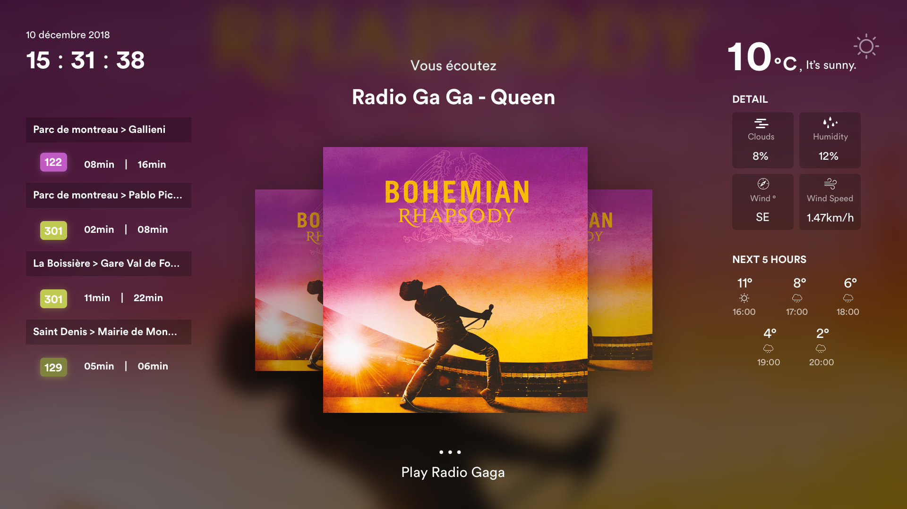
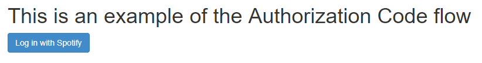

## What's the project ?
Board assistant is a personal project which consists on showing / doing different information on a screen (list non-exaustive) :
- Bus hours
- Weather
- And it can play spotify songs thanks to vocal recognition
**At the moment this project is still a prototype.**

The goal is to develop a simple tool which can daily help.
**Today**, it's possible to show bus passages, weather and play Spotify music. All these actions thanks to SpeechRecognition.
**On long term**, speech recognition should be managed from back side or specific micro service, each component should be a specific view, Board Assistant should integer new features / services. Also it should be deployed on hardware system like a Raspberry Pi. Maybe you have any further idea ?

### Take a quick look on what's look like :



## Technologies
- **ReactJS** → [Doc](https://reactjs.org/docs/getting-started.html)
- **Sass** → [Doc](http://sass-lang.com/documentation/file.SASS_REFERENCE.html)
- **Spotify API** → [Doc](https://developer.spotify.com/documentation/web-api/) Used for playing tracks
- **Annyang** → [Doc](https://www.talater.com/annyang/) Used for SpeechRecognition (it uses browser native SpeechRecognitionApi), for the moment only compatible with Firefox and Chrome browsers.

## What I'm working on
Currently looking for and trying some open source lib to manage SpeechRecognition on back side.
Working on Raspberry Pi configuration to run the project.


## Installation

#### 1. How to launch
You can download / clone the project from using github links.

##### 1.1 Add config file
Add `.env` file in *root folder*. Be sure it follows `.env_example` schema.


##### 1.2 Initialize base app
*Windows*
In 2 differents terminals type the following commands :
```
yarn run server
yarn run client
```

*OS X / Linux*
```
yarn run server && yarn run client
```
Then a new tab opens in your favourite browser. If you don't want to initialize spotify API, don't consider next step.


##### 1.3 Initialize Spotify playback *(optional)*
🚨 *For this part, be sure to have a premium account on Spotify.*

Create an application on Spotify [here](https://developer.spotify.com/dashboard/applications).
Then fill `CLIENT_ID` and `CLIENT_SECRET` of `.env` file, you're now ready to launch.


Click *"Login in"* button.

Then you are redirected to the App screen.


#### 2. How to use
Special mention for Spotify users ; you'll be able to use some vocal commands, here is the list : 
- `joue`: play a song (with this you can ask **song title**, **singer name** & **album name** all combined in command)
- `pause`: pause current track
- `play`: resume track
- `suivant`: play next track
- `précédent`: play previous track
- `*`: Everything you say which doesn't trigger a command is displayed on screen, so you have a feedback on what is understood by the application.
For more information, check the list of available commands [here](./documentation/commands.md)!

##### Configuration
For the moment commands doesn't work on every language. By default Speech Recognition is set in *French*, so you can change it as your convinience. To change it, open `./src/Vocal/index.js` and change commands set in constant `commands`, then change `annyang.setLanguage('fr-FR');` instruction with the language you want. 


## To contribute

### Pull requests
1. Create your branch
2. Push your work
3. Create your PR
  Be sure to :
    - Name the PR the good way
    - Call issue in decription like : "close #120"
    - Respect the PR template


### Commits
To commits our work, we use a package named [semantic-git-commit-cli](https://www.npmjs.com/package/semantic-git-commit-cli).<br/>
So you can use `yarn run sgc` to create a formalized commit.


### Issues
If you think about a new feature, or a bug to fix, please leave an issue and follow the template. 


### More informations

#### About the vocal recognition
We're currently using Annyang API, based on native browser SpeechRecognition API (only available on Chrome and Firefox).
The point is that it recognizes propers nouns, so we can easily use it to generate requests with artists, albums, tracks names...

For the next step, vocal recognition should be server side executed, so we'll no longer use Annyag API.
